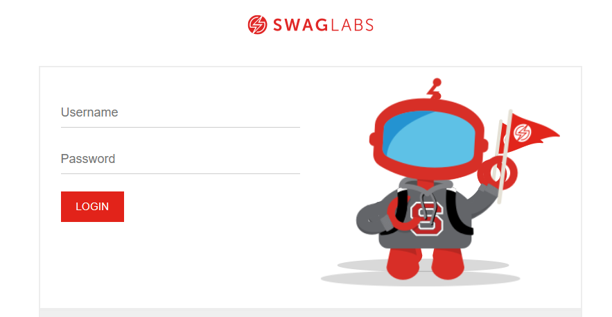

# 🕸️ Web Scraping & Price Change Detection  

## 📌 Overview  
This project automates the process of **scraping product details** from two e-commerce websites:  
# **TutorialsNinja**  
## 
# **SwagLabs**  
##  

With every run, product data (name + description + price) is **extracted and stored in a timestamped CSV file**.  
The system then compares the **current run** with the **previous run** for the same website.  

If product prices have changed, a separate CSV file (`Products_change_...csv`) is generated with only the modified items.  

---

## ⚙️ Tech Stack & Tools  
- **Java** – Core programming language  
- **Selenium WebDriver** – Automating browser scraping  
- **TestNG** – Test execution framework  
- **Fluent Design Pattern** – For clean Page Object Models  
- **CSV Utilities (OpenCSV / Apache Commons CSV)** – For reading/writing product data  

---

## 🔑 Features  
- Extract product **name and price** from multiple websites  
- Save product data into **timestamped CSV files**  
  - Example: `Data_Extracted_TutorialsNinja_20250822_165159.csv`  
- Automatically compare **current run vs previous run** for each website  
- Detect **price changes** and export them to a dedicated CSV file:  
  - `Products_change_TutorialsNinja.csv`  
  - `Products_change_SwagLabs.csv`  
- Works **independently per website** (TutorialsNinja and SwagLabs are compared separately)  

---

## 🚀 How It Works
1. Run the scraper → extract data from **TutorialsNinja** and/or **SwagLabs**.
2. Data is saved into a CSV file named with a timestamp.
  - Example: `Data_Extracted_SwagLabs_20250822_165914.csv`
3. The system automatically identifies the **latest file** and the **previous file** for the same website.
4. Prices are compared line by line (by product name).
5. If any price changed → a new CSV file is generated:
  - Example: `Products_change_SwagLabs.csv`

---

## ✅ Example Output (Products_change_TutorialsNinja.csv)  
